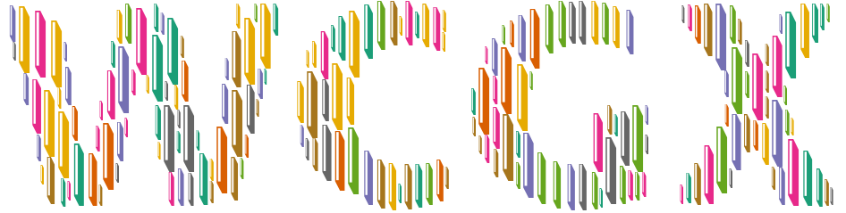

<h1 align="center">WordCloud Generator X-Treme</h1>

  

## Enchanting Creations Await
Within the heart of Windows, a singular, elegant executable awaits—a true artisan of word cloud imagery. [Here lies](https://github.com/komtraya/wcgx/releases) an enchanting realm where the essence of artistry is distilled into mesmerizing word cloud designs.

## A Symphony of Color
In this realm, your word cloud dances upon materials of any hue, except the purest white. It adapts gracefully to the color tapestries of your imagination.

## Showcase Your Masterpiece
As the curtain rises, an exquisite array of features unfolds before you:

- **Image Alchemy**: This app embraces all image formats with open arms, ensuring your word cloud takes on its unique form.

- **Font's Delight**: Summon the spirits of typography by setting fonts to your will, crafting the essence of your word cloud's expression.

- **Marginal Whispers**: Define the spaces between words, allowing your creation's poetry to breathe and dance.

- **Color Symphony**: Conductor of hues, choose from a symphony of color maps, or let your word cloud's palette cascade in gradients, echoing your artistic insight.

- **Character's Tale**: With character filtering, direct the tale of your word cloud, ensuring it speaks your truth.

- **Icon Enchantment**: A gallery of unicode emojis and Font Awesome icons beckons, granting your word cloud the charm of symbols and emblems.

- **Icon Masks**: Amplify your creation with icons as masks, reshaping your word cloud into symbols of your choosing.

- **Font Prelude**: On its debut, the application unearths your installed fonts, empowering you to clothe your word cloud in the attire it merits. On top of that, set forth on a quest to find fonts from your secret source.

- **Export Enigma**: Secret treasures unshrouded upon each export, as your word cloud transforms into PNG or SVG, ready to grace the world.

- **Scale Wizardry**: Fine-tune the dimensions of your word cloud, drawing upon the essence of the original mask image, with a multiplier's magic touch, up to a mystical maximum of 10x.

- **Efficiency’s Embrace**: Upon creation, the delete/stash button emerges, an enigmatic choice for your latest word cloud—discard or embrace its wonder. Stashed within a chamber known as "Keep", your masterpieces reside.

- **Settings Sanctuary**: Now, your configurations find refuge in a sacred space. Store and fetch them effortlessly, maintaining the essence of your artistic journey.

- **Font Quest**: Embark on a quest for fonts beyond the ordinary. With the power to download fonts directly within the application, expand your typographic arsenal and take your creations to unprecedented altitudes.

## Embark on the Journey
With [wcgx](https://github.com/komtraya/wcgx/releases) at your fingertips, you can embark on a magical journey, where your word cloud masterpiece awaits to be manifested in all its poetic splendor.

## Acknowledgements:

- [PySide6](https://pypi.org/project/PySide6/) (UI)
- [Wordcloud](https://pypi.org/project/wordcloud/)
- [Pillow](https://pypi.org/project/Pillow/) 
- [PyInstaller](https://pypi.org/project/pyinstaller/) (compiler)
